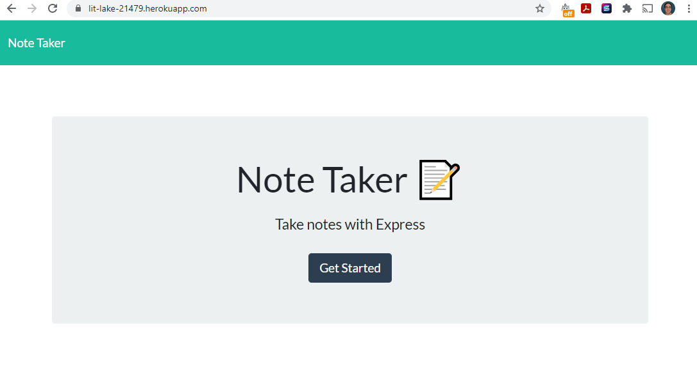
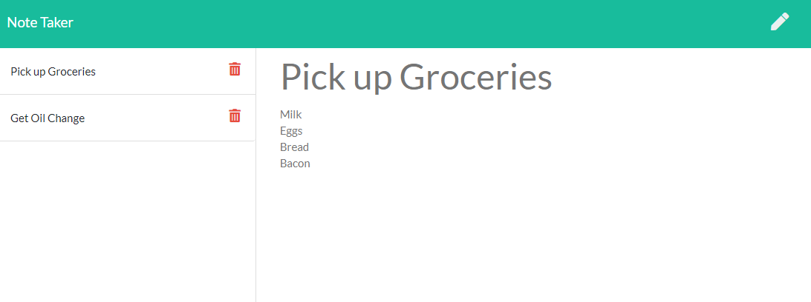

# Note Taker

## Description
This is a Note Taking app deployed to heroku. You can create, save and recall previous notes. You can also delete previously saved notes. The application was created using a combination of Javascript and Node.js. It uses the express and uuid packages as dependencies.

## Table of Contents
* [Installation](#Installation)
* [Usage](#Usage)
* [Technologies](#Technologies)
* [Preview](#Preview)

## Installation
No installation necessary, working app is deployed on heroku.

Use "npm i" to install the needed dependencies after copying the repository. If you want a local copy.

## Usage
Working app can be viewed at 

https://lit-lake-21479.herokuapp.com/

## Technologies
This application was made using

 
including the express.js and uuid npm packages 

## Preview
Screenshots

